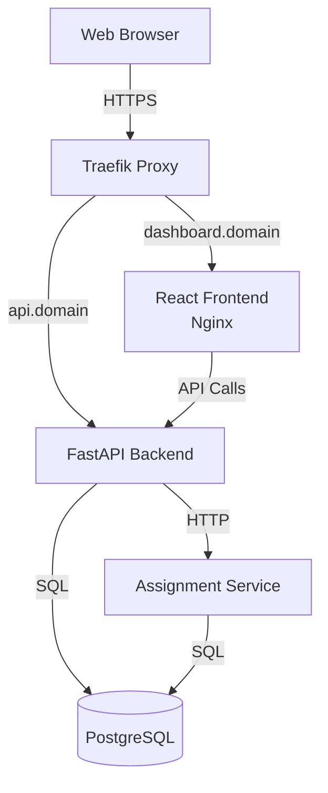

# Itemize: Manage and Track your Tasks

[](https://github.com/fastapi/full-stack-fastapi-template/actions?query=workflow%3ATest)
[](https://coverage-badge.samuelcolvin.workers.dev/redirect/fastapi/full-stack-fastapi-template)
[](LICENSE)

> Modern full-stack web application for tracking and assigning items with FastAPI backend, React frontend, and complete Docker
> deployment infrastructure.

## Table of Contents

- [Overview](#overview)
- [Technology Stack](#technology-stack)
- [Quickstart](#quickstart)
- [Configuration](#configuration)
- [Usage](#usage)
- [Architecture](#architecture)
- [Development](#development)
- [Deployment](#deployment)
- [Troubleshooting](#troubleshooting)
- [Contributing](#contributing)
- [License](#license)

## Overview

A full-stack task management application that enables teams to create, organize, and track tasks with assignment
capabilities. Built with a Python FastAPI backend and TypeScript React frontend, it provides role-based access
control, automated workflows, and real-time task assignment and tracking features.

## Technology Stack

### Backend
- **[FastAPI](https://fastapi.tiangolo.com)** - Modern Python web framework with automatic OpenAPI docs
- **[SQLModel](https://sqlmodel.tiangolo.com)** - SQL database ORM combining SQLAlchemy and Pydantic
- **[PostgreSQL 17](https://www.postgresql.org)** - Production-grade relational database
- **[Alembic](https://alembic.sqlalchemy.org)** - Database migration tool
- **[Pydantic](https://docs.pydantic.dev)** - Data validation and settings management
- **[uv](https://docs.astral.sh/uv/)** - Fast Python package manager
- **[Pytest](https://pytest.org)** - Testing framework with coverage reporting

### Frontend
- **[React 19](https://react.dev)** - Modern UI library with hooks
- **[TypeScript](https://www.typescriptlang.org)** - Type-safe JavaScript
- **[Vite](https://vitejs.dev)** - Fast build tool and dev server
- **[TanStack Router](https://tanstack.com/router)** - Type-safe routing
- **[TanStack Query](https://tanstack.com/query)** - Server state management
- **[Chakra UI v3](https://chakra-ui.com)** - Component library
- **[Playwright](https://playwright.dev)** - End-to-end testing
- **[Biome](https://biomejs.dev)** - Fast linter and formatter

### Infrastructure
- **[Docker Compose](https://docs.docker.com/compose/)** - Container orchestration
- **[Traefik](https://traefik.io)** - Reverse proxy with automatic HTTPS
- **[GitHub Actions](https://github.com/features/actions)** - CI/CD automation
- **[Nginx](https://nginx.org)** - Production web server for frontend

## Quickstart

### Prerequisites

**Required:**
- **OS**: Linux, macOS, or Windows with WSL2
- **Docker**: Version 20.10+ with Docker Compose V2
- **Git**: For cloning the repository

**For Local Development (Optional):**
- **Python**: 3.10 or higher
- **Node.js**: 20 LTS or higher
- **uv**: Fast Python package manager

### Setup with Docker Compose (Recommended)

This is the fastest way to get the full application running locally.

```bash
# Clone the repository
git clone https://github.com/fastapi/full-stack-fastapi-template.git
cd full-stack-fastapi-template

# Start all services
docker compose up --build
```

**Access the application:**
- Frontend: http://localhost:5173
- Backend API: http://localhost:8000
- API Documentation: http://localhost:8000/docs
- Database Admin: http://localhost:8080
- Assignment Service: http://localhost:8001

**Default credentials:**
- Email: `admin@example.com`
- Password: `changethis`

### Setup for Local Development

For faster iteration with hot-reload:

**Backend:**
```bash
cd backend

# Install dependencies
uv sync

# Activate virtual environment
source .venv/bin/activate  # On Windows: .venv\Scripts\activate

# Start PostgreSQL (in another terminal)
docker compose up -d db

# Run migrations
uv run bash scripts/prestart.sh

# Start development server
fastapi dev app/main.py
```

Backend will be available at http://localhost:8000

**Frontend:**
```bash
cd frontend

# Install dependencies
npm install

# Start development server
npm run dev
```

Frontend will be available at http://localhost:5173

### Verify Installation

```bash
# Check backend health
curl http://localhost:8000/api/v1/utils/health-check/

# Run backend tests
cd backend
uv run bash scripts/tests-start.sh

# Run frontend tests
cd frontend
npm run build
```

## Configuration

### Environment Variables

The application is configured via the `.env` file in the project root. Copy and customize it for your environment.

#### Required Variables (Must Change for Production)

| Variable | Default | Description |
|----------|---------|-------------|
| `SECRET_KEY` | `changethis` | Secret key for JWT tokens - generate with `python -c "import secrets; print(secrets.token_urlsafe(32))"` |
| `FIRST_SUPERUSER_PASSWORD` | `changethis` | Password for initial admin user |
| `POSTGRES_PASSWORD` | `changethis` | PostgreSQL database password |

#### Core Configuration

| Variable | Default | Description |
|----------|---------|-------------|
| `DOMAIN` | `localhost` | Base domain for deployment (e.g., `example.com`) |
| `ENVIRONMENT` | `local` | Environment: `local`, `staging`, or `production` |
| `PROJECT_NAME` | `Full Stack FastAPI Project` | Application name shown in UI and API docs |
| `STACK_NAME` | `full-stack-fastapi-project` | Docker Compose stack name (no spaces) |
| `FRONTEND_HOST` | `http://localhost:5173` | Frontend URL for CORS and email links |

#### Database Configuration

| Variable | Default | Description |
|----------|---------|-------------|
| `POSTGRES_SERVER` | `localhost` | PostgreSQL host (use `db` in Docker) |
| `POSTGRES_PORT` | `5432` | PostgreSQL port |
| `POSTGRES_DB` | `app` | Database name |
| `POSTGRES_USER` | `postgres` | Database user |

#### Authentication

| Variable | Default | Description |
|----------|---------|-------------|
| `FIRST_SUPERUSER` | `admin@example.com` | Email for initial admin user |
| `BACKEND_CORS_ORIGINS` | `http://localhost,http://localhost:5173,...` | Comma-separated list of allowed CORS origins |

#### Email Configuration (Optional)

| Variable | Default | Description |
|----------|---------|-------------|
| `SMTP_HOST` | _(empty)_ | SMTP server hostname |
| `SMTP_PORT` | `587` | SMTP server port |
| `SMTP_USER` | _(empty)_ | SMTP username |
| `SMTP_PASSWORD` | _(empty)_ | SMTP password |
| `SMTP_TLS` | `True` | Enable TLS |
| `SMTP_SSL` | `False` | Enable SSL |
| `EMAILS_FROM_EMAIL` | `info@example.com` | Sender email address |

#### Monitoring (Optional)

| Variable | Default | Description |
|----------|---------|-------------|
| `SENTRY_DSN` | _(empty)_ | Sentry DSN for error tracking |

#### Microservices

| Variable | Default | Description |
|----------|---------|-------------|
| `ASSIGNMENT_SERVICE_URL` | `http://assignment-service:8001` | URL for assignment microservice |

### Configuration Files

- **`.env`** - Main environment configuration
- **`frontend/.env`** - Frontend-specific variables (e.g., `VITE_API_URL`)
- **`backend/alembic.ini`** - Database migration configuration
- **`docker-compose.yml`** - Production service definitions
- **`docker-compose.override.yml`** - Development overrides
- **`docker-compose.traefik.yml`** - Traefik reverse proxy configuration

## Usage

### API Documentation

The backend provides interactive API documentation:

- **Swagger UI**: http://localhost:8000/docs
- **ReDoc**: http://localhost:8000/redoc
- **OpenAPI JSON**: http://localhost:8000/api/v1/openapi.json

### Authentication

**Register a new user:**
```bash
curl -X POST "http://localhost:8000/api/v1/users/signup" \
  -H "Content-Type: application/json" \
  -d '{
    "email": "user@example.com",
    "password": "securepassword",
    "full_name": "John Doe"
  }'
```

**Login:**
```bash
curl -X POST "http://localhost:8000/api/v1/login/access-token" \
  -H "Content-Type: application/x-www-form-urlencoded" \
  -d "username=admin@example.com&password=changethis"
```

Response:
```json
{
  "access_token": "eyJhbGciOiJIUzI1NiIsInR5cCI6IkpXVCJ9...",
  "token_type": "bearer"
}
```

### CRUD Operations

**Create an item:**
```bash
curl -X POST "http://localhost:8000/api/v1/items/" \
  -H "Authorization: Bearer YOUR_TOKEN" \
  -H "Content-Type: application/json" \
  -d '{
    "title": "My Item",
    "description": "Item description"
  }'
```

**List items:**
```bash
curl "http://localhost:8000/api/v1/items/?skip=0&limit=10" \
  -H "Authorization: Bearer YOUR_TOKEN"
```

**Update an item:**
```bash
curl -X PUT "http://localhost:8000/api/v1/items/{item_id}" \
  -H "Authorization: Bearer YOUR_TOKEN" \
  -H "Content-Type: application/json" \
  -d '{
    "title": "Updated Title",
    "description": "Updated description"
  }'
```

**Delete an item:**
```bash
curl -X DELETE "http://localhost:8000/api/v1/items/{item_id}" \
  -H "Authorization: Bearer YOUR_TOKEN"
```

### Frontend Client

The frontend uses an auto-generated TypeScript client:

```typescript
import { ItemsService, UsersService } from "@/client"

// Create an item
const newItem = await ItemsService.createItem({
  requestBody: {
    title: "My Item",
    description: "Item description"
  }
})

// List items with pagination
const items = await ItemsService.readItems({
  skip: 0,
  limit: 10
})
```

### Regenerating the TypeScript Client

After making changes to the backend API:

```bash
bash scripts/generate-client.sh
```

This will:
1. Export the OpenAPI specification from the backend
2. Generate TypeScript types and services
3. Update `frontend/src/client/`

## Architecture

### System Overview



### Component Architecture

**Backend (FastAPI):**
- `app/main.py` - Application entry point, CORS configuration
- `app/api/` - API route definitions
  - `routes/login.py` - Authentication endpoints
  - `routes/users.py` - User management
  - `routes/items.py` - Item CRUD operations
  - `routes/utils.py` - Health checks and utilities
  - `deps.py` - Dependency injection (database sessions, auth)
- `app/core/` - Core functionality
  - `config.py` - Settings management
  - `db.py` - Database engine and initialization
  - `security.py` - Password hashing and JWT tokens
- `app/models.py` - SQLModel database models and Pydantic schemas
- `app/crud.py` - Database operations abstraction
- `app/alembic/` - Database migrations

**Frontend (React):**
- `src/main.tsx` - Application entry point
- `src/routes/` - TanStack Router file-based routing
  - `_layout/` - Authenticated layout with navigation
  - `login.tsx`, `signup.tsx` - Authentication flows
  - `_layout/items.tsx` - Item management
  - `_layout/admin.tsx` - User management (admin only)
  - `_layout/settings.tsx` - User settings
- `src/components/` - Reusable UI components
- `src/client/` - Auto-generated API client
- `src/hooks/` - Custom React hooks (auth, toasts)

**Shared Models:**
- `shared-models/` - Python package with data models shared between services

### Data Flow

1. **User Authentication:**
   - User submits credentials via frontend
   - Backend validates and returns JWT token
   - Frontend stores token and includes in subsequent requests
   - Backend validates token on protected endpoints

2. **CRUD Operations:**
   - Frontend calls TypeScript client methods
   - Client makes HTTP requests to backend API
   - Backend validates JWT, checks permissions
   - Backend performs database operations via SQLModel
   - Backend returns JSON response
   - Frontend updates UI via TanStack Query cache

3. **Database Migrations:**
   - Developer modifies models in `app/models.py`
   - Run `alembic revision --autogenerate -m "description"`
   - Review and edit migration in `app/alembic/versions/`
   - Apply with `alembic upgrade head`

### Security Model

- **Password Storage**: Bcrypt hashing with salt
- **Authentication**: JWT tokens with configurable expiration
- **Authorization**: Role-based (regular user vs superuser)
- **CORS**: Configurable allowed origins
- **HTTPS**: Automatic via Traefik and Let's Encrypt in production
- **Database**: Parameterized queries via SQLModel (SQL injection protection)

## Development

### Local Development Workflow

**Using Docker Compose with hot-reload:**
```bash
# Start all services with file watching
docker compose watch

# View logs
docker compose logs -f backend
docker compose logs -f frontend

# Stop services
docker compose down
```

**Using local Python and Node.js:**
```bash
# Terminal 1: Backend
cd backend
uv sync
source .venv/bin/activate
docker compose up -d db
uv run bash scripts/prestart.sh
fastapi dev app/main.py

# Terminal 2: Frontend
cd frontend
npm install
npm run dev
```

### Code Quality

**Backend linting and formatting:**
```bash
cd backend

# Format code
uv run bash scripts/format.sh

# Lint code
uv run bash scripts/lint.sh

# Type checking
uv run mypy app
```

**Frontend linting and formatting:**
```bash
cd frontend

# Lint and format
npm run lint
```

### Testing

**Backend tests:**
```bash
cd backend

# Run all tests with coverage
uv run bash scripts/tests-start.sh

# Run specific test file
uv run pytest tests/api/routes/test_items.py

# Run with verbose output
uv run pytest -v tests/

# View coverage report
open htmlcov/index.html  # macOS
xdg-open htmlcov/index.html  # Linux
```

**Frontend E2E tests:**
```bash
cd frontend

# Run Playwright tests
npm run build
docker compose run --rm playwright npx playwright test

# Run with UI
docker compose run --rm playwright npx playwright test --ui

# Run specific test
docker compose run --rm playwright npx playwright test tests/login.spec.ts
```

### Database Management

**Create a new migration:**
```bash
cd backend

# Auto-generate migration from model changes
uv run alembic revision --autogenerate -m "Add new field to User"

# Review the generated migration in app/alembic/versions/

# Apply migration
uv run alembic upgrade head
```

**Rollback migration:**
```bash
cd backend

# Rollback one migration
uv run alembic downgrade -1

# Rollback to specific revision
uv run alembic downgrade <revision_id>
```

**View migration history:**
```bash
cd backend
uv run alembic history
uv run alembic current
```

### Database Access

**Using Adminer (web interface):**
- URL: http://localhost:8080
- System: PostgreSQL
- Server: db
- Username: postgres
- Password: changethis
- Database: app

**Using psql:**
```bash
docker compose exec db psql -U postgres -d app
```

### Pre-commit Hooks

Install pre-commit hooks to automatically format and lint code:

```bash
# Install pre-commit
pip install pre-commit

# Install hooks
pre-commit install

# Run manually on all files
pre-commit run --all-files
```

### Adding Dependencies

**Backend (Python):**
```bash
cd backend

# Add a package
uv add package-name

# Add a dev dependency
uv add --dev package-name

# Remove a package
uv remove package-name

# Update all packages
uv sync --upgrade
```

**Frontend (Node.js):**
```bash
cd frontend

# Add a package
npm install package-name

# Add a dev dependency
npm install --save-dev package-name

# Remove a package
npm uninstall package-name

# Update all packages
npm update
```

## Deployment

### Production Deployment with Docker Compose

This template supports deployment to a single server with Traefik handling HTTPS certificates automatically.

**Prerequisites:**
- Linux server with Docker and Docker Compose
- Domain name with DNS pointing to your server
- Ports 80 and 443 open

**Setup:**

1. **Create Traefik network:**
```bash
docker network create traefik-public
```

2. **Configure environment:**
```bash
# Update .env file
DOMAIN=example.com
ENVIRONMENT=production
FRONTEND_HOST=https://dashboard.example.com

# Generate secure secrets
SECRET_KEY=$(python -c "import secrets; print(secrets.token_urlsafe(32))")
FIRST_SUPERUSER_PASSWORD=$(python -c "import secrets; print(secrets.token_urlsafe(32))")
POSTGRES_PASSWORD=$(python -c "import secrets; print(secrets.token_urlsafe(32))")
```

3. **Deploy Traefik:**
```bash
docker compose -f docker-compose.traefik.yml up -d
```

4. **Deploy application:**
```bash
docker compose -f docker-compose.yml up -d --build
```

**Access points:**
- Frontend: https://dashboard.example.com
- Backend API: https://api.example.com
- API Docs: https://api.example.com/docs
- Database Admin: https://adminer.example.com
- Traefik Dashboard: https://traefik.example.com

### CI/CD with GitHub Actions

The template includes automated workflows:

**Continuous Integration:**
- `lint-backend.yml` - Lints Python code with Ruff
- `test-backend.yml` - Runs Pytest with coverage
- `playwright.yml` - Runs E2E tests (4-shard parallelization)
- `test-docker-compose.yml` - Tests Docker stack
- `generate-client.yml` - Auto-generates TypeScript client

**Continuous Deployment:**
- `deploy-staging.yml` - Deploys to staging on push to `master`
- `deploy-production.yml` - Deploys to production on release publish

**Setup self-hosted runners:**

1. On your server, install GitHub Actions runner
2. Label runners: `staging` or `production`
3. Configure secrets in GitHub repository settings:
   - `DOMAIN`
   - `SECRET_KEY`
   - `FIRST_SUPERUSER_PASSWORD`
   - `POSTGRES_PASSWORD`
   - SMTP credentials (if using email)

**Deployment workflow:**
```bash
# Deploy to staging
git push origin master

# Deploy to production
gh release create v1.0.0 --generate-notes
```

### Multi-Environment Setup

Run staging and production on the same server:

```bash
# Staging environment
DOMAIN=staging.example.com STACK_NAME=staging-app docker compose up -d

# Production environment
DOMAIN=example.com STACK_NAME=production-app docker compose up -d
```

### Health Checks

**Backend health:**
```bash
curl https://api.example.com/api/v1/utils/health-check/
```

**Database health:**
```bash
docker compose exec db pg_isready -U postgres
```

**View logs:**
```bash
# All services
docker compose logs -f

# Specific service
docker compose logs -f backend
docker compose logs -f frontend
```

### Backup and Restore

**Backup database:**
```bash
docker compose exec db pg_dump -U postgres app > backup.sql
```

**Restore database:**
```bash
docker compose exec -T db psql -U postgres app < backup.sql
```

## Troubleshooting

### Common Issues

**Issue: `docker compose` command not found**
- **Cause**: Using old Docker Compose V1 syntax
- **Fix**: Use `docker compose` (V2) instead of `docker-compose` (V1), or upgrade Docker

**Issue: Port already in use**
- **Cause**: Another service is using ports 5432, 8000, or 5173
- **Fix**: Stop conflicting services or change ports in `docker-compose.override.yml`

**Issue: Database connection refused**
- **Cause**: PostgreSQL container not ready
- **Fix**: Wait for health check to pass: `docker compose ps` should show `healthy` status

**Issue: Frontend shows CORS errors**
- **Cause**: Backend CORS origins not configured correctly
- **Fix**: Add frontend URL to `BACKEND_CORS_ORIGINS` in `.env`

**Issue: TypeScript client types are outdated**
- **Cause**: Backend API changed but client not regenerated
- **Fix**: Run `bash scripts/generate-client.sh`

**Issue: Alembic migration fails**
- **Cause**: Database schema out of sync or migration conflict
- **Fix**: Check current revision with `alembic current`, review migration files, or reset database

**Issue: Tests fail with database errors**
- **Cause**: Test database not initialized
- **Fix**: Ensure `docker compose up -d db` is running before tests

**Issue: Hot-reload not working in Docker**
- **Cause**: File watching not configured
- **Fix**: Use `docker compose watch` instead of `docker compose up`

**Issue: Email sending fails**
- **Cause**: SMTP credentials not configured
- **Fix**: Set `SMTP_HOST`, `SMTP_USER`, `SMTP_PASSWORD` in `.env`, or use MailCatcher for local dev

**Issue: Traefik certificate errors**
- **Cause**: Let's Encrypt rate limits or DNS not propagated
- **Fix**: Verify DNS with `dig example.com`, check Traefik logs, wait for rate limit reset

### Debug Mode

**Enable verbose logging:**
```bash
# Backend
docker compose logs -f backend

# Frontend
docker compose logs -f frontend

# Database
docker compose logs -f db
```

**Access container shell:**
```bash
# Backend
docker compose exec backend bash

# Frontend
docker compose exec frontend sh

# Database
docker compose exec db bash
```

**Check environment variables:**
```bash
docker compose exec backend env
```

### Performance Issues

**Slow Docker builds:**
- Use BuildKit: `DOCKER_BUILDKIT=1 docker compose build`
- Clear build cache: `docker builder prune`

**Slow database queries:**
- Check indexes in models
- Use `EXPLAIN ANALYZE` in PostgreSQL
- Monitor with Adminer or pgAdmin

**High memory usage:**
- Limit container resources in `docker-compose.yml`
- Reduce number of workers in production

## Contributing

We welcome contributions! Please see [CONTRIBUTING.md](CONTRIBUTING.md) for guidelines.

**Quick start:**
1. Fork the repository
2. Create a feature branch: `git checkout -b feature/my-feature`
3. Make your changes
4. Run tests and linting
5. Commit with conventional commits: `feat: add new feature`
6. Push and create a pull request

**Development standards:**
- Follow existing code style
- Add tests for new features
- Update documentation
- Keep commits focused and atomic

## License

This project is licensed under the MIT License - see the [LICENSE](LICENSE) file for details.

Copyright (c) 2019 Sebastián Ramírez

---

## Additional Resources

- [Backend Development Guide](backend/README.md)
- [Frontend Development Guide](frontend/README.md)
- [Deployment Guide](deployment.md)
- [Development Guide](development.md)
- [Microservices Setup](MICROSERVICES_SETUP.md)
- [Release Notes](release-notes.md)
- [Security Policy](SECURITY.md)

## Support

- **Documentation**: https://fastapi.tiangolo.com
- **Issues**: https://github.com/fastapi/full-stack-fastapi-template/issues
- **Discussions**: https://github.com/fastapi/full-stack-fastapi-template/discussions
